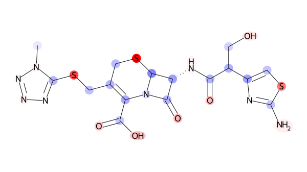
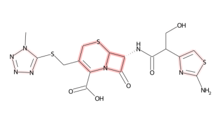
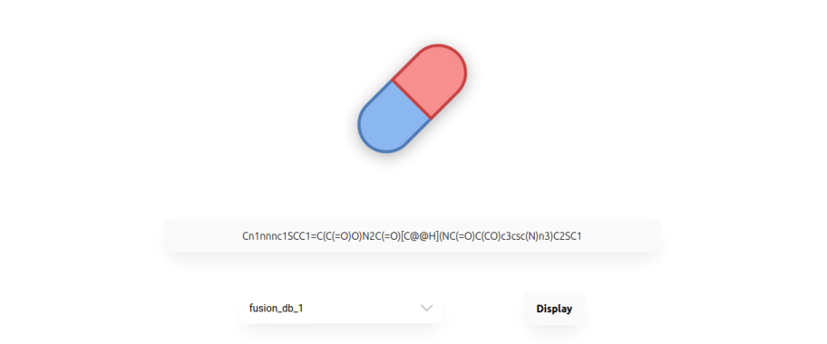

# Chemexp

A Chemprop explainer based on [LIME](https://github.com/marcotcr/lime) and [PathExplain](https://github.com/suinleelab/path_explain).

 

## Installation

- Make sure your Python version is >= **3.8**
- `conda` is required for ChemProp. If it is not installed on your machine, you can take a look at [miniconda](https://docs.conda.io/en/latest/miniconda.html)

1. Install [Chemprop](https://github.com/chemprop/chemprop)
2. Then simply run `pip install chemexp`
3. You're good to go!

## Explanation

### Using Python

```python
import chemexp
from chemprop.utils import load_checkpoint

model = chemexp.ExplanationModel(load_checkpoint("models/fusion_db_1.pt"))
exp = model.explain_molecule("COC(=N)Cc1ccccc1")
chemexp.exp_to_png(exp, "mol.png")
```

A little more detail is available in [test/test.py](test/test.py).

### Web interface



Although you can use this Python module in your scripts, you can also experiment a user-friendly interface.  
⚠️ **Warning:** this only works on Linux for the moment *(this is due to the [linux-specific paths](chemexp/server.py#L26) used to save some files, but it can be adapted for Windows or Mac)*.

Use the following command to run the web server:

```shell
python -m chemexp <path>
```

where `path` is a folder containing chemprop models / checkpoints (.pt files)


## Authors
- BELLANGER Clément
- [BERNIER Fabien](https://wwwfr.uni.lu/snt/people/fabien_bernier)
- MAIGRET Bernard
- [NAPOLI Amedeo](https://members.loria.fr/ANapoli/)

To cite our work:
```
@mastersthesis{bernier:hal-03371070,
  TITLE = {{A Study about Explainability and Fairness in Machine Learning and Knowledge Discovery}},
  AUTHOR = {Bernier, Fabien},
  URL = {https://hal.inria.fr/hal-03371070},
  PAGES = {58},
  SCHOOL = {{TELECOM Nancy}},
  YEAR = {2021},
  MONTH = Sep,
  KEYWORDS = {machine learning ; explainability ; fairness ; antibiotic classification ; machine learning ; explicabilit{\'e} ; fairness ; classification antibiotique},
  PDF = {https://hal.inria.fr/hal-03371070/file/M_moire_ing_nieur_Fabien.pdf#chapter.5},
  HAL_ID = {hal-03371070},
  HAL_VERSION = {v1},
}
```
